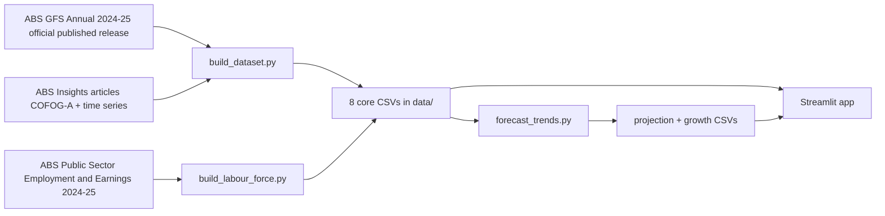

# 🏛️ Australian Government Budget Transparency Dashboard


Interactive exploration of Australian government finances — where the money comes from, where it goes, and how the fiscal position has trended over the last decade.

**Live demo:** https://govt-budget-transparency-dashboard.streamlit.app

## Business context

Public budget documents are dense and hard to navigate for non-specialists. This dashboard turns official ABS Government Finance Statistics into an interactive Sankey/treemap/trend view — the kind of transparency tool a policy team, journalist, or engaged citizen would actually use.

## Data

Australian Bureau of Statistics, **Government Finance Statistics, Annual, 2024-25** (published 21 April 2026), all levels of Australian government (Commonwealth, state, territory, local), current prices, original series. Figures are transcribed directly from ABS's published release and Insights articles — no estimation or fabrication.

- https://www.abs.gov.au/statistics/economy/government/government-finance-statistics-annual/latest-release
- https://www.abs.gov.au/articles/insights-government-finance-statistics-annual-2024-25

Also uses ABS **Public Sector Employment and Earnings, Australia** (cat. 6248.0.55.002), 2024-25 financial year (released 6 November 2025), for the Labour Force & Productivity tab.

- https://www.abs.gov.au/statistics/labour/employment-and-unemployment/public-sector-employment-and-earnings/latest-release

## Architecture



## App

7 tabs: Budget Flow (Sankey) · Category Breakdown (treemap + YoY) · Fiscal Trends (revenue/expenses/NOB) · Debt & Net Worth · Growth Drivers · Growth & Outlook (category growth/decline, structural balance, 5-year linear trend extrapolation) · Labour Force & Productivity (public sector employment and wages by state/territory, level of government, and industry).

**Important honesty note baked into the app itself:** the "outlook" projections are a simple linear trend fit over 10 annual data points — not an official fiscal forecast. Real budget forecasts (PBO, Treasury) model GDP growth, demographics, and policy settings explicitly. This is presented as illustrative direction only, clearly labeled in-app. The net operating balance trend in particular carries an R² of 0.009 — essentially no linear relationship with time — and the app surfaces this explicitly rather than hiding a weak fit.

The Labour Force & Productivity tab is similarly honest about its limits: it compares jobs growth vs wages growth as a **cost-intensity signal**, not a true labour productivity measure — no output data exists in this dataset to compute genuine productivity, and the app says so directly rather than implying otherwise.

**Design:** a light-blue "liquid glass" theme — translucent, backdrop-blurred chart cards, a soft wave divider, subtle shimmer animation — distinct from the dark-themed style used across this portfolio's other Streamlit projects.

## Project structure

```
govt-budget-transparency-dashboard/
├── .streamlit/config.toml
├── .gitignore
├── LICENSE
├── README.md
├── app.py
├── requirements.txt
├── src/
│   ├── build_dataset.py         # transcribes official ABS GFS figures into CSVs
│   ├── build_labour_force.py    # transcribes ABS Public Sector Employment figures into CSVs
│   └── forecast_trends.py       # linear trend extrapolation + category growth calc
└── data/
    ├── cofog_expenses.csv
    ├── fiscal_time_series.csv
    ├── net_worth_debt.csv
    ├── expense_growth_drivers.csv
    ├── revenue_breakdown.csv
    ├── net_debt_projection.csv
    ├── net_operating_balance_projection.csv
    ├── category_growth.csv
    ├── public_sector_employment_by_state.csv
    ├── public_sector_employment_national.csv
    └── public_sector_employment_by_industry.csv
```

## Data Dictionary

### `category_growth.csv`
| Column | Type | Description |
|---|---|---|
| category | string | COFOG-A expense category name |
| amt_2024_25 | float | Category expense, 2024-25, $billion |
| amt_2023_24 | float | Category expense, 2023-24, $billion |
| change_billion | float | Dollar change 2023-24 → 2024-25, $billion |
| change_pct | float | Percentage change 2023-24 → 2024-25 |

### `cofog_expenses.csv`
| Column | Type | Description |
|---|---|---|
| year | string | Financial year (e.g. 2024-25) |
| category | string | COFOG-A functional expense category |
| pct_of_total | float | Category's share of total expenses, % |
| amount_billion | float | Category expense, $billion |

### `expense_growth_drivers.csv`
| Column | Type | Description |
|---|---|---|
| driver | string | Named driver of expense growth |
| growth_pct | float | Growth rate attributed to driver, % |
| contribution_billion | float | Dollar contribution to total growth, $billion |
| pct_of_total_growth | float | Driver's share of total expense growth, % |

### `fiscal_time_series.csv`
| Column | Type | Description |
|---|---|---|
| year | string | Financial year, 2015-16 to 2024-25 |
| revenue_billion | float | Total government revenue, $billion |
| expenses_billion | float | Total government expenses, $billion |
| net_operating_balance_billion | float | Revenue minus expenses, $billion |

### `net_debt_projection.csv`
| Column | Type | Description |
|---|---|---|
| year | string | Financial year, historical + 5-year projection |
| net_debt_pct_gdp | float | Net debt as % of GDP (historical or projected) |
| is_projection | bool | True if extrapolated, False if historical ABS figure |
| resid_std | float | Residual standard deviation of the linear fit |
| r2 | float | R² of the linear trend model (0.602 — moderate signal) |

### `net_operating_balance_projection.csv`
| Column | Type | Description |
|---|---|---|
| year | string | Financial year, historical + 5-year projection |
| net_operating_balance_billion | float | NOB, historical or projected, $billion |
| is_projection | bool | True if extrapolated, False if historical ABS figure |
| resid_std | float | Residual standard deviation of the linear fit |
| r2 | float | R² of the linear trend model (0.009 — no real linear relationship) |

### `net_worth_debt.csv`
| Column | Type | Description |
|---|---|---|
| year | string | Financial year, 2015-16 to 2024-25 |
| net_worth_billion | float | Government net worth, $billion |
| net_debt_billion | float | Government net debt, $billion |
| net_debt_pct_gdp | float | Net debt as % of GDP |

### `revenue_breakdown.csv`
| Column | Type | Description |
|---|---|---|
| component | string | Revenue source category |
| pct_of_revenue | float | Share of total revenue, % |
| growth_pct | float | YoY growth rate, % |

### `public_sector_employment_by_state.csv`
| Column | Type | Description |
|---|---|---|
| state | string | Australian state or territory |
| level_of_government | string | Commonwealth, State, or Local (ACT Local combined into State per ABS convention) |
| employee_jobs_thousands_jun24 | float | Employee jobs, June 2024, thousands |
| employee_jobs_thousands_jun25 | float | Employee jobs, June 2025, thousands |
| cash_wages_millions_2023_24 | float | Cash wages and salaries, 2023-24 financial year, $million |
| cash_wages_millions_2024_25 | float | Cash wages and salaries, 2024-25 financial year, $million |

### `public_sector_employment_national.csv`
| Column | Type | Description |
|---|---|---|
| level_of_government | string | Commonwealth, State, Local, or Total Public Sector |
| employee_jobs_thousands_jun24 | float | Employee jobs, June 2024, thousands |
| employee_jobs_thousands_jun25 | float | Employee jobs, June 2025, thousands |
| cash_wages_millions_2023_24 | float | Cash wages and salaries, 2023-24 financial year, $million |
| cash_wages_millions_2024_25 | float | Cash wages and salaries, 2024-25 financial year, $million |
| jobs_growth_pct | float | Derived: % growth in employee jobs, Jun-24 → Jun-25 |
| wages_growth_pct | float | Derived: % growth in cash wages, 2023-24 → 2024-25 |
| avg_wage_per_job_2024_25_thousands | float | Derived: average cash wages per employee job, 2024-25, $thousand |

### `public_sector_employment_by_industry.csv`
| Column | Type | Description |
|---|---|---|
| industry | string | ANZSIC-based industry classification |
| employee_jobs_thousands_jun24 | float | Employee jobs, June 2024, thousands |
| employee_jobs_thousands_jun25 | float | Employee jobs, June 2025, thousands |
| cash_wages_millions_2023_24 | float | Cash wages and salaries, 2023-24 financial year, $million |
| cash_wages_millions_2024_25 | float | Cash wages and salaries, 2024-25 financial year, $million |

**Source for GFS-derived datasets:** ABS Government Finance Statistics, Annual 2024-25, all levels of Australian government, current prices, original series.

**Source for employment datasets:** ABS Public Sector Employment and Earnings, Australia (cat. 6248.0.55.002), 2024-25 financial year.

## Key figures, 2024-25

| Metric | Value |
|---|---|
| Total expenses | $1,030.5b |
| Total revenue | $1,022.4b |
| Net operating balance | -$8.2b |
| Net debt (% GDP) | 34.4% |
| Largest expense category | Social protection (30.3%, $312.2b) |
| Fastest $ growth | Social protection (+$29.1b, +10.3%) |
| Only shrinking categories | Environmental protection (-2.4%), Economic affairs (-1.4%) |

## Key figures — Labour Force & Productivity

| Metric | Value |
|---|---|
| Total public sector employee jobs, Jun-25 | 2,597.3k (+3.26% vs Jun-24) |
| Total public sector cash wages, 2024-25 | $249.5b (+7.64% vs 2023-24) |
| Average wage per job, 2024-25 | $96.1k |
| Fastest wages growth by level of government | Commonwealth (+9.48%) |
| Largest employer by jobs, state government | NSW (566.1k state-level jobs, Jun-25) |
| Largest public sector wage bill by industry | Public administration and safety ($90.2b, 2024-25) |
| Second largest by industry | Health care and social assistance ($66.2b) |
| Third largest by industry | Education and training ($61.4b) |

## Quickstart

```bash
python -m venv venv
venv\Scripts\Activate.ps1        # Windows
pip install -r requirements.txt
python src/build_dataset.py         # builds the core GFS CSVs from ABS figures
python src/build_labour_force.py    # builds the public sector employment CSVs
python src/forecast_trends.py       # builds the trend-extrapolation + growth CSVs
streamlit run app.py
```

## Tech stack

Python · Pandas · NumPy · scikit-learn · Streamlit · Plotly (Sankey, treemap) · ABS GFS + Public Sector Employment data

## Limitations

- Only 2 years of category-level (COFOG-A) detail available (2023-24, 2024-25) — deeper historical category trends aren't possible without additional ABS releases
- Only 2 years of public sector employment/wages detail available (Jun-24, Jun-25), matching the same ABS release cadence limitation
- No productivity, output, or sector-employment data — this dataset covers fiscal flows only, not economic productivity by sector (would need a separate ABS Multifactor Productivity or Labour Force series)
- The jobs-growth-vs-wages-growth comparison in the Labour Force tab is a cost-intensity signal, not a true productivity measure — explicitly labeled as such in-app
- Outlook tab is a basic linear trend, not a real fiscal forecast — explicitly caveated in-app
- No automated test suite yet

## Roadmap

- State/territory-level budget breakdown by expense category (currently all-levels-of-government aggregate only for COFOG-A detail; would require compiling individual state Budget Papers, since ABS does not publish a category × state cross-tab centrally)
- pytest suite + CI badge
- React/Vite companion webapp

## License

MIT — see [LICENSE](LICENSE)
